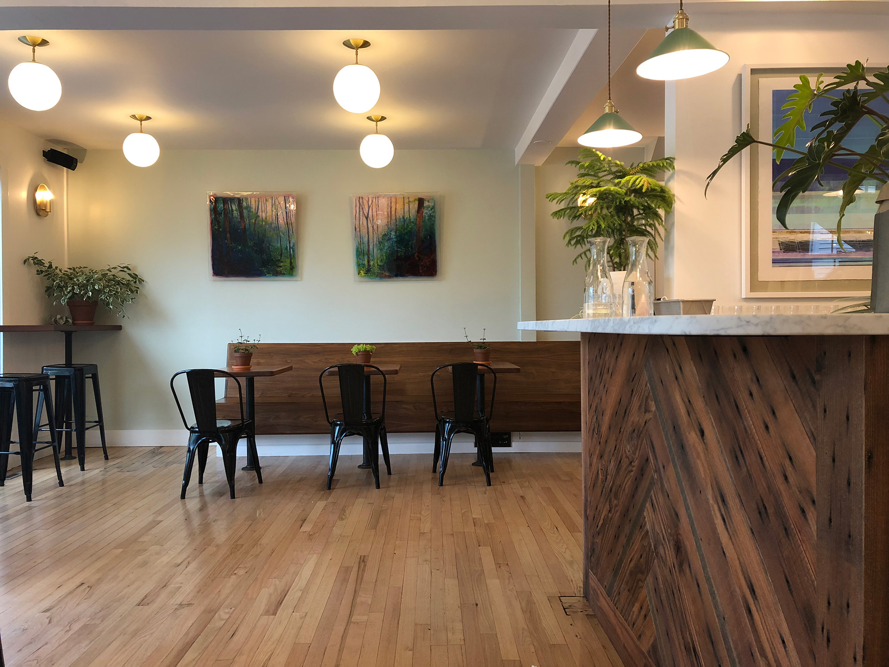
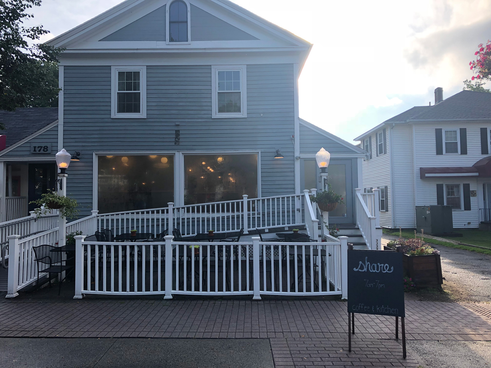
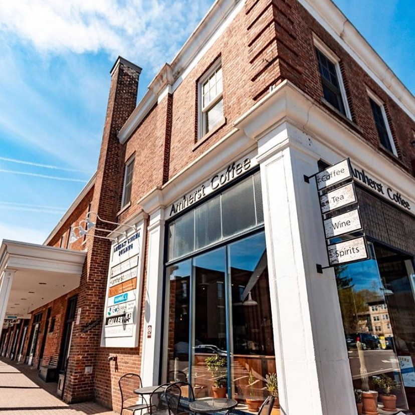
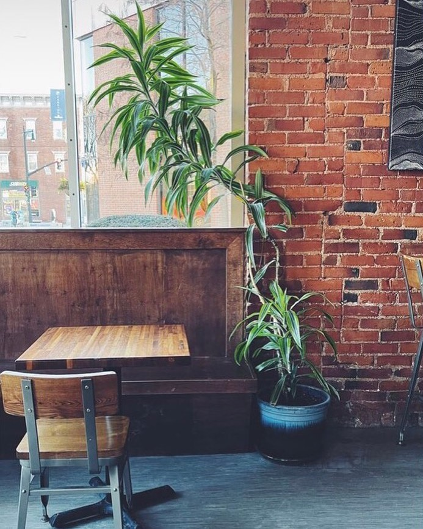

<!DOCTYPE html>
<html lang="en">
<head>
    <meta charset="UTF-8">
    <link rel="stylesheet" href="hw1.css">
</head>
<body>
    <h1>Jordan's Amherst Cafe reviews</h1>

    

        

            
        

        

            
        

        <h2><a href="https://www.instagram.com/shareroasters/" class="on">Share Amherst</a></h2>
        
Formerly known as Rao's coffee. This cafe is located in Amherst downtown. The interior is a
            has a light polished ambiance that anyone can appreciate. Their coffee is amazing with Their
            beans being sourced directly from Share roasters and their baristas are the best
            at brewing the best lattes. Additionally, they produce delicous bakery goods and have a kitchen
            that provide a very high quality and healthy meal. This is definitely my favorite cafe that I rate
            very highly. 
        

        <table>
            <tr>
              <th>Positives</th>
              <th>Negatives</th>
            </tr>
            <tr>
              <td>Best Coffee in town</td>
              <td>Small seating capacity</td>

            </tr>
            <tr>
              <td>Tasty and healthy food menu</td>
              <td>Pricey costs for fancy drinks</td>
            </tr>
            <tr>
                <td>Vegan options</td>
                <td>Small Seating capacity</td>
            </tr>
            <tr>
                <td>Fast Wi-fi</td>
                <td>Only open till 4pm</td>
            </tr>
          </table>
    

    

        

            
        

        

            
        

        <h2><a href="https://amherstcoffee.com" class="on">Amherst Coffee</a></h2>
        
 Located in the historic Amherst Cinema building in Amherst downtown, this cafe can provide
            an excellent experience for those that are looking to enjoy a conversation with friends,
            or get some work done with the background noise of an authentic cafe.
            With its dark-wood furniture and bare lightbulbs, Amherst coffee immediately stands out
            with its darker and refined veneer. This darker ambiance is one of the ways the cafe caters
            more towards an older post-student population of residents that frequent the location both 
            during the day and night, which is when it turns into a bar. 
            There's plenty of seating with the option of outdoor seating as well. 
            The coffee is very strong and great however there are very few options for flavoring
            for those that prefer caffienated drinks with flavor shots.
            The biggest downside however is that the cafe no longer offers Wi-Fi so for the 90%
            of people that need to use the internet, they'll need to obtain access to a hotspot.
        

        <table>
            <tr>
              <th>Positives</th>
              <th>Negatives</th>
            </tr>
            <tr>
              <td>Most caffienated coffee in town</td>
              <td>Lack of flavorful options</td>

            </tr>
            <tr>
              <td>Darkwood ambiance</td>
              <td>Furniture slightly uncomfortable</td>
            </tr>
            <tr>
                <td>Lots of seating</td>
                <td>NO WI-FI!</td>
            </tr>
          </table>
    

    
Copyright 2022 Jordan Gyaltsen

</body>

</html>
